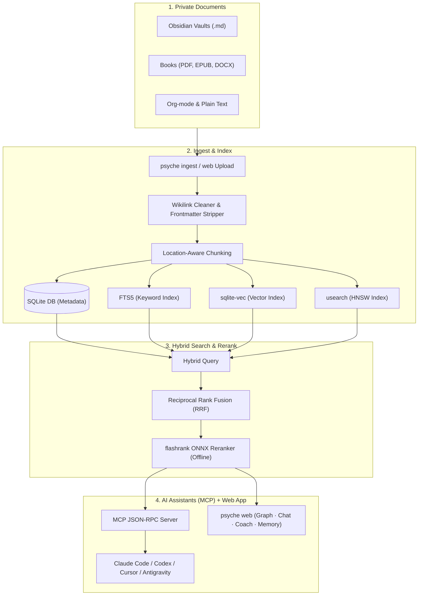

# Psyche 🧠

<div align="center">
  <p><strong>A private second brain your whole AI toolchain can remember.</strong></p>
  <p>Turn your books, notes and documents into a searchable, cited knowledge base — and give Claude Code, Codex, Gemini and Antigravity <em>one shared memory</em>. 100% local. $0 to run.</p>

  [](https://github.com/Nam-Aniket/psyche)
  [](https://github.com/Nam-Aniket/psyche)
  [](https://github.com/Nam-Aniket/psyche)
  [](https://modelcontextprotocol.io)
  [](https://github.com/Nam-Aniket/psyche/stargazers)
</div>

---

## The problem, in one sentence

**Your AI assistant has amnesia — and you pay for it, in tokens, every single session.**

Every new session, your coding agent re-reads the same files to rediscover your conventions, re-asks about preferences you stated last week, and repeats mistakes it already made. Meanwhile your actual knowledge — the books you've read, the notes you've written, the decisions you've made — sits in folders no AI can see.

Psyche fixes both halves:

1. **A knowledge layer** — your PDFs, EPUBs, Obsidian vaults and docs become a hybrid-searchable, *cited* library every MCP-capable assistant can query.
2. **A memory layer** — durable facts (preferences, decisions, lessons) are extracted automatically and shared across **every agent you use**. A preference stated in Codex is known to Claude Code. A lesson learned in Antigravity follows you everywhere.

Everything runs on your machine. Nothing is uploaded. No subscription, no API bill for memory.

---

## ⚡ 60-second start

```bash
git clone https://github.com/Nam-Aniket/psyche.git
cd psyche
./setup.sh
psyche web
```

`psyche web` opens the app in your browser and — on first launch — **auto-wires every AI agent it detects on your machine** (Claude Code, Codex, Gemini CLI / Antigravity). From there:

- **Drag documents in** → chunked, embedded and indexed locally in seconds.
- **Graph** → an interactive concept map of everything you've ingested.
- **Chat** → ask questions, get passages with source, author and page citations.
- **Coach** → guidance briefs grounded in *your* library, not generic advice.
- **Memory** → watch the facts your agents accumulate, scoped per topic.
- **Setup** → see exactly which agents are wired, connect new ones in one click.

> Prefer pip? `pipx install git+https://github.com/Nam-Aniket/psyche.git` gives you the same `psyche` CLI.

---

## 🔒 Built on trust (local-first & private)

Hosted RAG and memory SaaS tools have one fatal flaw: they require uploading your private thoughts, diaries and books to somebody else's server.

Psyche is built from the ground up for absolute data safety:

- 🛡️ **100% local indexing** — parsing, chunking and vector embeddings all run on your machine (ONNX models or Ollama).
- 🚫 **No silent uploads** — your documents never leave your disk. The web app binds to `127.0.0.1`.
- 🔍 **Strict citations** — every search result carries the file, chapter or page it came from, so you can verify instantly.

---

## 🖥️ The web app

One command, no config files, no YAML. `psyche web` gives you:

| Tab | What it does for you |
|---|---|
| **Setup** | Live connection status for Claude Code, Codex, Gemini and Antigravity — one click wires an agent's real config files (backed up first, idempotent) |
| **Upload** | Drag-and-drop ingestion for PDF, EPUB, Markdown, DOCX, Org and TXT, with real titles and authors parsed from document metadata |
| **Graph** | A living concept map — click any node to read its definition and trace what it connects to |
| **Chat** | Cited passages from your library; wire a chat model (free Gemini key or local Ollama) for written answers |
| **Coach** | Guidance briefs grounded in your ingested books and your tracked goals and rules |
| **Memory** | Every durable fact your agents have saved — filterable, topic-scoped, with an entity graph |

Topic libraries keep separate corpora separate: a `naval` library for decision-making, a research library for a paper, your default library for everything else — switchable from the app bar.

---

## 🔁 One memory. Every agent. $0.

Psyche's atomic memory layer is a mem0-class engine — extraction, deduplication, hybrid retrieval, entity links — that runs entirely on your machine and is shared by every agent you use.

| | The old way | With Psyche |
|---|---|---|
| Session start | Agent rediscovers context from scratch | Standing facts injected automatically |
| Each prompt | You re-explain, agent re-reads | Up to ~800 tokens of *relevant* facts — only on a strong match, never noise |
| Session end | Everything is forgotten | Durable facts extracted and stored, zero tokens billed to your agent |
| Your data | Re-uploaded to a hosted memory SaaS | Never leaves your disk |
| Cross-agent | Each tool has its own silo | One shared local store for all of them |

The mechanics that make it free and fast:

- ✂️ **ADD-only writes with a cosine duplicate guard** — no per-fact LLM judging loops burning API calls; conflicts resolve at read time by recency.
- 🎯 **Similarity-gated injection** — weak matches inject *nothing*, and a session ledger guarantees a fact is never injected twice. Memory that wastes tokens isn't memory, it's noise.
- 🔍 **Three-signal retrieval** — HNSW vectors + FTS5 keywords + entity matching, fused with Reciprocal Rank Fusion.
- 🧊 **Cache-stable injection** — facts are injected as a byte-stable, cache-aligned block (ordered by immutable id, volatile fields stripped), so your host model *reads* its prompt cache instead of re-writing it. `psyche mem stats` reports measured cache behavior straight from your transcripts.

### How each agent gets its memory

| Agent | Integration | What Psyche writes |
|---|---|---|
| **Claude Code** | Fully automatic lifecycle hooks — recall at session start and on every prompt, extraction on compact/end. Zero tool schemas, zero model overhead | `~/.claude/settings.json` (MCP entry + 5 hooks) |
| **Codex** | MCP tools + a memory-protocol block guiding when to save and search; `notify` chained for auto-capture | `~/.codex/config.toml` + `~/.codex/AGENTS.md` |
| **Gemini CLI / Antigravity** | Same hook schema as Claude Code, plus the protocol block | `~/.gemini/settings.json`, `mcp_config.json` + `GEMINI.md` |
| **Cursor / Claude Desktop** | MCP memory tools (`add_memory`, `search_memories`, …) — the model drives memory itself | `~/.cursor/mcp.json` / desktop config |

Every write is **backed up once** (`*.psyche-bak`) and **idempotent** — running connect twice changes nothing. Your existing hooks and MCP servers are always preserved.

> [!NOTE]
> Search and injection run on local ONNX embeddings out of the box. Automatic fact *extraction* from transcripts activates when a chat model is configured (`psyche setup` — a free Gemini key or local Ollama both work). Without one, facts still accumulate through the `add_memory` tool — everything else works identically.

---

## 🧠 Stateful agent memory (Letta/MemGPT hierarchy)

Beyond atomic facts, Psyche gives agents a full hierarchical memory:

1. **Document knowledge (archival RAG)** — hybrid FTS5 (BM25) + HNSW vector search over your files (`search_knowledge`).
2. **Core memory (RAM)** — key-value guidelines the agent reads and writes dynamically (`write_memory_core`).
3. **Archival memory (disk)** — vector-embedded logs and learnings for long-term reference (`append_memory_archival`).
4. **Interaction history (recall)** — stateful conversation logging across sessions (`record_interaction`).
5. **Atomic memory (cross-agent facts)** — the deduplicated, entity-linked fact store described above.

---

## 🧭 Personal guidance engine

Psyche actively tracks your goals, experiments and hard-won rules across domains (Business, Health, Wealth, Career, Happiness, Ideation) — and grounds every piece of advice in the books and notes *you* chose to ingest.

- **Goals & metrics** — what you're trying to achieve and how success is measured.
- **Experiments** — actionable hypotheses with explicit success/failure conditions.
- **Reviews & rules** — log what worked, crystalize lessons into principles your AI will hold you to.
- **Guidance briefs** — `generate_guidance` fuses your goals, rules and library (RRF + cross-encoder reranking) into a structured brief on what to do next. Also available as the **Coach** tab.

---

## 🍳 Recipes

### 📓 Chat with your Obsidian vault
Frontmatter stripped, wikilinks cleaned (`[[Concept|Display]]` → `Display`), tags extracted:
```bash
psyche ingest ~/Obsidian/PersonalVault
```

### 📚 Query a folder of PDFs and ebooks
Real titles and authors are parsed from document metadata; pages are tracked for citations:
```bash
psyche ingest ~/Downloads/Books --ext pdf,epub
```

> [!TIP]
> **Malformed PDFs?** Install `pymupdf` in Psyche's environment for C-accelerated, highly robust parsing, then re-ingest with `--force`.

### 💾 Run fully offline with Ollama
Configure Ollama (`llama3` + `nomic-embed-text`) in the setup wizard and query your index with no network at all:
```bash
psyche setup
```

### 🤖 Wire an agent from the terminal
The web app's Setup tab does this in one click, but the CLI works too:
```bash
psyche connect claude-code   # or: codex, gemini, antigravity, cursor
```

---

## 🏗️ How it works (system architecture)



1. **Ingest** — scan folders or drag files into the web app.
2. **Process** — chunk text, clean markdown, prepare metadata (real titles/authors from PDF/EPUB metadata).
3. **Embed & index** — local ONNX embeddings into `sqlite-vec` and a `usearch` HNSW index.
4. **Retrieve** — lexical (FTS5 BM25) + semantic matches fused with **Reciprocal Rank Fusion**.
5. **Rerank** — a lightweight ONNX cross-encoder (`flashrank`) rescores on CPU.
6. **Serve** — MCP tools for your agents, and the web app for you.

---

## 🔮 Theme mapping (GraphRAG concept networks)

Run `psyche build-graph` (or hit **Rebuild** in the Graph tab) to cluster your corpus into a concept network, then ask:

- *"What themes connect my notes on career, discipline, and AI agents?"*
- *"Summarize how my Stoicism files relate to my writing tips."*

---

## 🚀 Installation

### Clone & run (recommended)
```bash
git clone https://github.com/Nam-Aniket/psyche.git
cd psyche
./setup.sh
psyche web
```

### Pipx
```bash
pipx install git+https://github.com/Nam-Aniket/psyche.git
```

### Manual MCP configuration (Claude Desktop example)
`psyche connect` (or the web Setup tab) handles Claude Code, Codex, Gemini, Antigravity and Cursor automatically. For Claude Desktop, add to `~/Library/Application Support/Claude/claude_desktop_config.json`:
```json
{
  "mcpServers": {
    "psyche": {
      "command": "/path/to/psyche/.venv/bin/python",
      "args": ["/path/to/psyche/cli.py", "start-mcp"]
    }
  }
}
```

---

## 🧪 Running tests
```bash
.venv/bin/python -m unittest discover tests
```

---

## ⭐ Support the project

If Psyche gives your AI assistants a local brain worth keeping, star the repo — it helps other developers discover local-first, privacy-first tooling.
