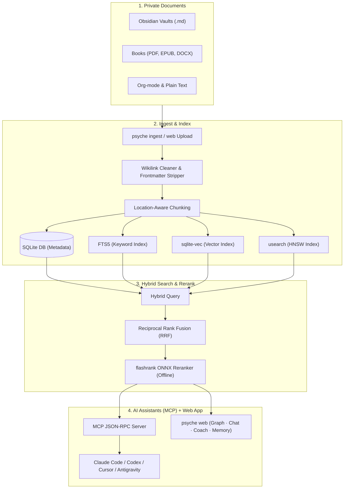

# Psyche 🧠

<div align="center">
  <p><strong>A private second brain your whole AI toolchain can remember.</strong></p>
  <p>Your books, notes and documents become a searchable, cited library. Your agents (Claude Code, Codex, Gemini, Antigravity) share one memory. Everything stays on your machine. Running it costs $0.</p>

  [](https://github.com/Nam-Aniket/psyche)
  [](https://github.com/Nam-Aniket/psyche)
  [](https://github.com/Nam-Aniket/psyche)
  [](https://modelcontextprotocol.io)
  [](https://github.com/Nam-Aniket/psyche/stargazers)
</div>

---

## Sound familiar?

You open a new session and your coding agent has forgotten everything. Again.

It re-reads the same files to rediscover your conventions. It asks about preferences you stated last week. It repeats a mistake you already corrected. You pay for every bit of that re-learning in tokens, in latency, and in patience. Every single session.

And the knowledge you actually care about? The books you have read, the notes you have written, the decisions you have made. All of it sits in folders no AI can see.

Two problems. One tool.

1. **A knowledge layer.** Your PDFs, EPUBs, Obsidian vaults and docs become a hybrid-searchable library. Every answer carries a citation with source, author and page.
2. **A memory layer.** Durable facts (preferences, decisions, lessons) are captured automatically and shared across every agent you use. State a preference in Codex and Claude Code knows it. Learn a lesson in Antigravity and it follows you everywhere.

Nothing is uploaded. There is no subscription. Memory costs you zero API calls.

---

## Try it in 60 seconds

```bash
git clone https://github.com/Nam-Aniket/psyche.git
cd psyche
./setup.sh
psyche web
```

That last command opens the app in your browser. On first launch it detects the AI agents on your machine (Claude Code, Codex, Gemini CLI, Antigravity) and wires them up automatically. Then:

1. **Drag your documents in.** Chunked, embedded and indexed locally in seconds.
2. **Ask a question in Chat.** Get passages back with author and page citations.
3. **Open a new agent session anywhere.** Your facts are already there.

Prefer pip? `pipx install git+https://github.com/Nam-Aniket/psyche.git` gives you the same `psyche` CLI.

---

## The web app

One command. No config files. No YAML.

| Tab | What it gives you |
|---|---|
| **Setup** | Live connection status per agent. One click wires an agent's real config files, backed up first |
| **Upload** | Drag-and-drop ingestion for PDF, EPUB, Markdown, DOCX, Org and TXT. Real titles and authors parsed from metadata |
| **Graph** | A living concept map of your library. Click any node to read its definition and trace its connections |
| **Chat** | Cited passages from your documents. Wire a chat model (free Gemini key or local Ollama) for written answers |
| **Coach** | Guidance briefs grounded in your books and your tracked goals, not generic advice |
| **Memory** | Every fact your agents have saved. Filterable, topic-scoped, with an entity graph |

Topic libraries keep separate corpora separate: one for decision-making books, one for research papers, one default for everything else. Switch from the app bar.

---

## One memory. Every agent. $0.

Psyche's memory engine does what hosted memory services do (extraction, deduplication, hybrid retrieval, entity links) with one difference: it runs entirely on your machine and every agent shares it.

| | Without Psyche | With Psyche |
|---|---|---|
| Session start | Agent rediscovers context from scratch | Standing facts injected automatically |
| Each prompt | You re-explain, the agent re-reads | Only strongly matching facts injected, never noise |
| Session end | Everything is forgotten | Durable facts extracted and stored, zero tokens billed |
| Your data | Uploaded to a memory SaaS | Never leaves your disk |
| Across agents | Each tool keeps its own silo | One shared local store |

Why it stays fast and free:

- **ADD-only writes with a cosine duplicate guard.** No LLM judging loop burning API calls per fact. Conflicts resolve at read time by recency.
- **Similarity-gated injection.** A weak match injects nothing, and a session ledger guarantees no fact is injected twice. Memory that wastes tokens is not memory, it is noise.
- **Three-signal retrieval.** HNSW vectors, FTS5 keywords and entity matching, fused with Reciprocal Rank Fusion.
- **Cache-stable injection.** Facts are injected as a byte-stable block (ordered by immutable id, volatile fields stripped), so your host model reads its prompt cache instead of rewriting it. `psyche mem stats` reports measured cache behavior from your own transcripts.

### How each agent gets its memory

| Agent | Integration | Files Psyche writes |
|---|---|---|
| **Claude Code** | Fully automatic lifecycle hooks: recall at session start and on every prompt, extraction at session end. Zero model overhead | `~/.claude/settings.json` |
| **Codex** | MCP tools plus a memory-protocol block, with `notify` chained for auto-capture | `~/.codex/config.toml`, `~/.codex/AGENTS.md` |
| **Gemini CLI / Antigravity** | Same hooks as Claude Code, plus the protocol block | `~/.gemini/settings.json`, `mcp_config.json`, `GEMINI.md` |
| **Cursor / Claude Desktop** | MCP memory tools the model calls itself | `~/.cursor/mcp.json` / desktop config |

Every write is backed up once (`*.psyche-bak`) and idempotent: running connect twice changes nothing. Your existing hooks and MCP servers are always preserved.

> [!NOTE]
> Search and injection run on local ONNX embeddings out of the box. Automatic fact extraction from transcripts activates when a chat model is configured (`psyche setup`; a free Gemini key or local Ollama both work). Without one, facts still accumulate through the `add_memory` tool and everything else works identically.

---

## Private by design

Hosted RAG and memory tools share one fatal flaw: your diaries, books and half-formed thoughts end up on somebody else's server.

Psyche is built so that cannot happen:

- **100% local indexing.** Parsing, chunking and embeddings all run on your machine (ONNX models or Ollama).
- **No silent uploads.** The web app binds to `127.0.0.1`. Your documents never leave your disk.
- **Strict citations.** Every result names its file, chapter or page. You can verify any claim in seconds.

---

## Beyond facts: a full memory hierarchy

Agents get more than atomic facts. Psyche implements a layered memory in the style of Letta/MemGPT:

1. **Document knowledge**: hybrid FTS5 (BM25) and HNSW vector search over your files (`search_knowledge`)
2. **Core memory**: key-value guidelines the agent reads and writes dynamically (`write_memory_core`)
3. **Archival memory**: vector-embedded logs and learnings for long-term reference (`append_memory_archival`)
4. **Interaction history**: conversation logging across sessions (`record_interaction`)
5. **Atomic memory**: the deduplicated, entity-linked, cross-agent fact store described above

---

## A coach grounded in your books

Generic AI advice is worthless because it is not about you. Psyche tracks your goals, experiments and hard-won rules across domains (Business, Health, Wealth, Career, Happiness, Ideation) and grounds every brief in the books and notes you chose to ingest.

- **Goals and metrics**: what you are trying to achieve and how success is measured
- **Experiments**: hypotheses with explicit success and failure conditions
- **Reviews and rules**: log what worked, turn lessons into principles your AI holds you to
- **Guidance briefs**: `generate_guidance` fuses your goals, rules and library into a structured next-step brief. Also available as the Coach tab

---

## Recipes

### Chat with your Obsidian vault
Frontmatter stripped, wikilinks cleaned (`[[Concept|Display]]` becomes `Display`), tags extracted:
```bash
psyche ingest ~/Obsidian/PersonalVault
```

### Query a folder of PDFs and ebooks
Titles and authors come from document metadata. Pages are tracked for citations:
```bash
psyche ingest ~/Downloads/Books --ext pdf,epub
```

> [!TIP]
> Malformed PDFs? Install `pymupdf` in Psyche's environment for robust C-accelerated parsing, then re-ingest with `--force`.

### Run fully offline with Ollama
Configure Ollama (`llama3` plus `nomic-embed-text`) in the setup wizard and query your index with no network at all:
```bash
psyche setup
```

### Wire an agent from the terminal
The Setup tab does this in one click. The CLI works too:
```bash
psyche connect claude-code   # or: codex, gemini, antigravity, cursor
```

---

## Under the hood



1. **Ingest**: scan folders or drag files into the web app
2. **Process**: chunk text, clean markdown, parse real titles and authors from PDF/EPUB metadata
3. **Embed and index**: local ONNX embeddings into `sqlite-vec` and a `usearch` HNSW index
4. **Retrieve**: lexical (FTS5 BM25) and semantic matches fused with Reciprocal Rank Fusion
5. **Rerank**: a lightweight ONNX cross-encoder (`flashrank`) rescores on CPU
6. **Serve**: MCP tools for your agents, the web app for you

### Concept networks (GraphRAG)

Run `psyche build-graph` (or hit Rebuild in the Graph tab) to cluster your corpus into a concept network. Then ask things like:

- *"What themes connect my notes on career, discipline, and AI agents?"*
- *"Summarize how my Stoicism files relate to my writing tips."*

---

## Installation

### Clone and run (recommended)
```bash
git clone https://github.com/Nam-Aniket/psyche.git
cd psyche
./setup.sh
psyche web
```

### Pipx
```bash
pipx install git+https://github.com/Nam-Aniket/psyche.git
```

### Manual MCP configuration (Claude Desktop example)
`psyche connect` (or the Setup tab) handles Claude Code, Codex, Gemini, Antigravity and Cursor automatically. For Claude Desktop, add to `~/Library/Application Support/Claude/claude_desktop_config.json`:
```json
{
  "mcpServers": {
    "psyche": {
      "command": "/path/to/psyche/.venv/bin/python",
      "args": ["/path/to/psyche/cli.py", "start-mcp"]
    }
  }
}
```

---

## Running tests
```bash
.venv/bin/python -m unittest discover tests
```

---

## ⭐ Support the project

If Psyche gives your AI assistants a local brain worth keeping, star the repo. It helps other developers find local-first, privacy-first tooling.
