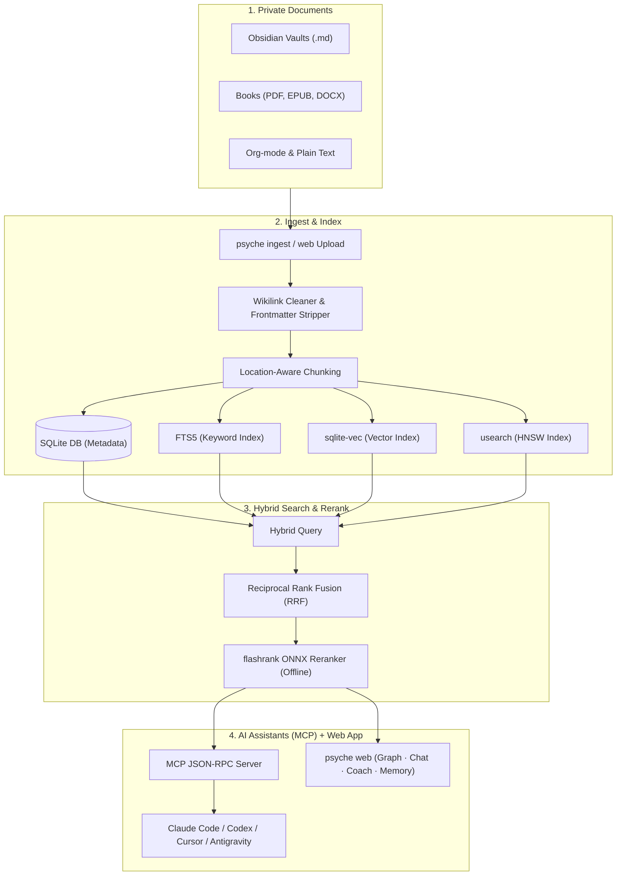

# Psyche 🧠

<div align="center">
  <p><strong>One inspectable memory shared by your AI coding tools.</strong></p>
  <p>Claude Code, Codex, Gemini and Antigravity can recall the same decisions, preferences and lessons. Indexing, retrieval and memory storage are local by default; cloud chat and extraction are explicit opt-ins.</p>

  [](https://github.com/Nam-Aniket/psyche)
  [](https://github.com/Nam-Aniket/psyche/actions/workflows/ci.yml)
  [](https://github.com/Nam-Aniket/psyche)
  [](https://github.com/Nam-Aniket/psyche)
  [](https://modelcontextprotocol.io)
  [](https://github.com/Nam-Aniket/psyche/stargazers)
</div>

---

## Sound familiar?

You open a new session and your coding agent has forgotten everything. Again.

It re-reads the same files to rediscover your conventions. It asks about preferences you stated last week. It repeats a mistake you already corrected. You pay for every bit of that re-learning in tokens, in latency, and in patience. Every single session.

And the knowledge you actually care about? The books you have read, the notes you have written, the decisions you have made. All of it sits in folders no AI can see.

Two problems. One tool.

1. **A knowledge layer.** Your PDFs, EPUBs, Obsidian vaults and docs become a hybrid-searchable library. Every answer carries a citation with source, author and page.
2. **A memory layer.** Durable facts (preferences, decisions, lessons) are shared across every connected agent. State a preference in Codex and Claude Code can retrieve it. Learn a lesson in Antigravity and it can follow you into the next session.

The default local path requires no subscription or API calls. If you choose Gemini or OpenAI for chat/extraction, Psyche clearly labels the text sent to that provider.

---

## Quick start

```bash
git clone https://github.com/Nam-Aniket/psyche.git
cd psyche
./setup.sh
.venv/bin/psyche web
```

`./setup.sh` creates Psyche's isolated environment and configuration. It does **not** replace commands, edit AI client configs, install a background service, or add Git hooks. `.venv/bin/psyche web` opens the local app; its Setup tab detects supported agents and lets you connect each one explicitly. Then:

1. **Drag your documents in.** Chunked, embedded and indexed locally in seconds.
2. **Ask a question in Chat.** Get passages back with author and page citations.
3. **Open a new agent session anywhere.** Your facts are already there.

Prefer pipx?

```bash
pipx install git+https://github.com/Nam-Aniket/psyche.git
psyche setup
psyche web
```

Before connecting an agent, preview every proposed file change with `.venv/bin/psyche connect --dry-run` (clone) or `psyche connect --dry-run` (pipx).

---

## The web app

One command. No config files. No YAML.

| Tab | What it gives you |
|---|---|
| **Setup** | Live connection status per agent. One click wires an agent's real config files, backed up first |
| **Upload** | Drag-and-drop ingestion for PDF, EPUB, Markdown, DOCX, Org and TXT. Real titles and authors parsed from metadata |
| **Graph** | A living concept map of your library. Click any node to read its definition and trace its connections |
| **Chat** | Cited passages from your documents. Wire Gemini or local Ollama for written answers |
| **Coach** | Guidance briefs grounded in your books and your tracked goals, not generic advice |
| **Memory** | Every fact your agents have saved. Filterable, topic-scoped, with an entity graph |

Topic libraries keep separate corpora separate: one for decision-making books, one for research papers, one default for everything else. Switch from the app bar.

---

## One memory. Every agent. Local by default.

Psyche keeps its database, indexes and retrieval pipeline on your machine while giving every connected agent access to the same store.

| | Without Psyche | With Psyche |
|---|---|---|
| Session start | Agent rediscovers context from scratch | Standing facts injected automatically |
| Each prompt | You re-explain, the agent re-reads | Only strongly matching facts injected, never noise |
| Session end | Everything is forgotten | Durable facts can be extracted and stored |
| Your data | Uploaded to a memory SaaS | Stored locally; remote models are optional and disclosed |
| Across agents | Each tool keeps its own silo | One shared local store |

Why the default local path stays fast:

- **ADD-only writes with a cosine duplicate guard.** No LLM judging loop burning API calls per fact. Conflicts resolve at read time by recency.
- **Similarity-gated injection.** A weak match injects nothing, and a session ledger guarantees no fact is injected twice. Memory that wastes tokens is not memory, it is noise.
- **Three-signal retrieval.** HNSW vectors, FTS5 keywords and entity matching, fused with Reciprocal Rank Fusion.
- **Cache-stable injection.** Facts are injected as a byte-stable block (ordered by immutable id, volatile fields stripped), so your host model reads its prompt cache instead of rewriting it. `psyche mem stats` reports measured cache behavior from your own transcripts.

### How each agent gets its memory

| Agent | Integration | Files Psyche writes |
|---|---|---|
| **Claude Code** | Lifecycle hooks recall at session start and on prompts. Transcript extraction runs only when a chat/extraction provider is explicitly configured | `~/.claude/settings.json` |
| **Codex** | MCP tools plus a memory-protocol block, with `notify` chained for auto-capture | `~/.codex/config.toml`, `~/.codex/AGENTS.md` |
| **Gemini CLI / Antigravity** | Same hooks as Claude Code, plus the protocol block | `~/.gemini/settings.json`, `mcp_config.json`, `GEMINI.md` |
| **Cursor / Claude Desktop** | MCP memory tools the model calls itself | `~/.cursor/mcp.json` / desktop config |

Every write is backed up once (`*.psyche-bak`) and idempotent: running connect twice changes nothing. Your existing hooks and MCP servers are always preserved.

> [!NOTE]
> Search and injection use local ONNX embeddings out of the box. Automatic fact extraction from transcripts activates when you explicitly configure a chat model (`psyche setup`; Gemini, OpenAI or local Ollama). Claude CLI extraction is disabled by default and can be opted into with `PSYCHE_ALLOW_CLAUDE_CLI_EXTRACTION=1`. Without an extractor, facts still accumulate through the `add_memory` tool.

---

## Local-first data flow

Psyche never silently changes from a local path to a cloud path:

| Configuration | What stays local | What leaves the machine |
|---|---|---|
| Local ONNX + no chat | Documents, chunks, embeddings, indexes, memories and retrieval | Nothing |
| Local ONNX + Ollama | Everything | Nothing, assuming Ollama is running locally |
| Gemini or OpenAI chat/extraction | Documents, indexes, memories and retrieval | Retrieved passages or transcript excerpts needed for the selected operation |
| Claude CLI extraction opt-in | Documents, indexes, memories and retrieval | Transcript excerpts sent through the user's Claude CLI session |

The web app binds to `127.0.0.1`. Every retrieval result names its source file, chapter or page so you can inspect what grounded it. The setup wizard also supports cloud embedding providers and labels those options as cloud processing.

---

## Beyond facts: a full memory hierarchy

Agents get more than atomic facts. Psyche implements a layered memory in the style of Letta/MemGPT:

1. **Document knowledge**: hybrid FTS5 (BM25) and HNSW vector search over your files (`search_knowledge`)
2. **Core memory**: key-value guidelines the agent reads and writes dynamically (`write_memory_core`)
3. **Archival memory**: vector-embedded logs and learnings for long-term reference (`append_memory_archival`)
4. **Interaction history**: conversation logging across sessions (`record_interaction`)
5. **Atomic memory**: the deduplicated, entity-linked, cross-agent fact store described above

---

## A coach grounded in your books

Generic AI advice is worthless because it is not about you. Psyche tracks your goals, experiments and hard-won rules across domains (Business, Health, Wealth, Career, Happiness, Ideation) and grounds every brief in the books and notes you chose to ingest.

- **Goals and metrics**: what you are trying to achieve and how success is measured
- **Experiments**: hypotheses with explicit success and failure conditions
- **Reviews and rules**: log what worked, turn lessons into principles your AI holds you to
- **Guidance briefs**: `generate_guidance` fuses your goals, rules and library into a structured next-step brief. Also available as the Coach tab

---

## Recipes

### Chat with your Obsidian vault
Frontmatter stripped, wikilinks cleaned (`[[Concept|Display]]` becomes `Display`), tags extracted:
```bash
psyche ingest ~/Obsidian/PersonalVault
```

### Query a folder of PDFs and ebooks
Titles and authors come from document metadata. Pages are tracked for citations:
```bash
psyche ingest ~/Downloads/Books --ext pdf,epub
```

> [!TIP]
> Malformed PDFs? Install `pymupdf` in Psyche's environment for robust C-accelerated parsing, then re-ingest with `--force`.

### Run fully offline with Ollama
Configure Ollama (`llama3` plus `nomic-embed-text`) in the setup wizard and query your index with no network at all:
```bash
psyche setup
```

### Wire an agent from the terminal
The Setup tab does this in one click. The CLI works too:
```bash
psyche connect claude-code   # or: codex, gemini, antigravity, cursor
```

---

## Under the hood



1. **Ingest**: scan folders or drag files into the web app
2. **Process**: chunk text, clean markdown, parse real titles and authors from PDF/EPUB metadata
3. **Embed and index**: local ONNX embeddings into `sqlite-vec` and a `usearch` HNSW index
4. **Retrieve**: lexical (FTS5 BM25) and semantic matches fused with Reciprocal Rank Fusion
5. **Rerank**: a lightweight ONNX cross-encoder (`flashrank`) rescores on CPU
6. **Serve**: MCP tools for your agents, the web app for you

### Concept networks (GraphRAG)

Run `psyche build-graph` (or hit Rebuild in the Graph tab) to cluster your corpus into a concept network. Then ask things like:

- *"What themes connect my notes on career, discipline, and AI agents?"*
- *"Summarize how my Stoicism files relate to my writing tips."*

---

## Installation

### Clone and run (recommended)
```bash
git clone https://github.com/Nam-Aniket/psyche.git
cd psyche
./setup.sh
.venv/bin/psyche web
```

### Pipx
```bash
pipx install git+https://github.com/Nam-Aniket/psyche.git
psyche setup
psyche web
```

### Optional host integrations

The default installer changes no AI client configs, background services or Git hooks.

```bash
psyche connect --dry-run   # preview exact agent-config changes
psyche connect             # connect detected agents after you approve
psyche setup --watcher     # optional background ingestion service
psyche setup --git-hook    # optional hook in this checkout
./setup.sh --global-link   # optional ~/.local/bin/psyche link; never overwrites
```

### Manual MCP configuration (Claude Desktop example)
`psyche connect` (or the Setup tab) handles Claude Code, Codex, Gemini, Antigravity and Cursor automatically. For Claude Desktop, add to `~/Library/Application Support/Claude/claude_desktop_config.json`:
```json
{
  "mcpServers": {
    "psyche": {
      "command": "/path/to/psyche/.venv/bin/python",
      "args": ["/path/to/psyche/cli.py", "start-mcp"]
    }
  }
}
```

---

## Running tests
```bash
.venv/bin/python -m unittest discover tests
```

---

## ⭐ Support the project

If Psyche gives your AI assistants a local brain worth keeping, star the repo. It helps other developers find local-first, privacy-first tooling.
